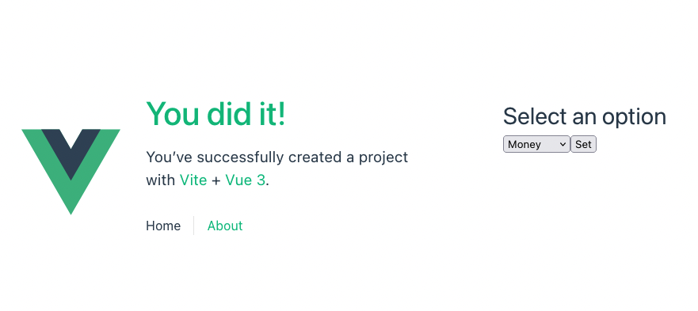
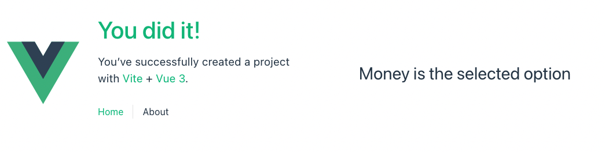

# PINIA STATE MANAGEMENT EXAMPLE

This project is based on a [Pinia intro](https://www.youtube.com/watch?v=JGC7aAC-3y8) by [Make Apps with Danny](https://www.youtube.com/channel/UC6eR_ndNgaTeE5t2Ud4ZiHw).

Since 20222, [Pinia](https://pinia.vuejs.org) has become [the standard store](https://www.youtube.com/watch?v=2KBHvaAWJOA) for global state management. Thus, replacing [Vuex](https://vuex.vuejs.org) in Vue applications.

Checkout commits in [this project](https://github.com/gabrielcostasilva/vue-blog/tree/pinia-replace-vuex) for better understanding differences between Vuex and Pinia.

## Project Overview

This project uses the default Vue app created with `npm init vue@latest`. The idea is saving the state set on a _view_ by using Pinia. Then, one can retrieve the same (global) state in another _view_ (`AboutView`). 

Notice that one can convey state by using `events`, like in this [example](https://github.com/gabrielcostasilva/vue-project-planner). However, there are use cases that benefit from sharing global state with a state management tool. For instance, when a user needs customised settings, such as a personalised theme.

### Home _view_

The _home_ page shows the `HomeView` by default. In addition, it shows a link to the _About_ page (`AboutView`).

The `HomeView` consists of a html `select` element with three options, _Money_, _Hapiness_ and _Peace_. The state is set by clicking on the `Set` button. 



### About _view_

The `AboutView` retrieves the state from the Pinia store, and shows a message. 

The page transition is set by the Vue router, configured automatically when the project is created.



## Pinia Setup

In this project, Pinia is automatically added by selecting an option during the project creation with `npm init vue@latest`. However, adding Pinia into an existing Vue 3 project is as simple as [running](https://pinia.vuejs.org/getting-started.html#installation) `npm install pinia`.

One can think of a Pinia store as a shared object. Therefore, the first step is to define this object. In this project, this is done by exporting an object from the `store.js` file. The object is created by `defineStore`, from the `pinia package`.

```js
import { defineStore } from 'pinia'

export const useSharedValueStore = defineStore('sharedValueStore', {})
```

A store has a **unique** name, set as the first parameter of `defineStore()` function. The second parameter is the object that defines the store, including state and behaviour. The [official documentation](https://pinia.vuejs.org/core-concepts/#using-the-store) states that one can create as many stores as one wants, but they recommend using a different file. 

Notice that Pinia requires additional configuration into the `main.js` file, as the snippet below shows. However, this additional configuration is done automatically when the project is created with the Pinia option.

```js
// ...
import { createPinia } from 'pinia'

// ... 

app.use(createPinia())

// ...
```

### State

The function `state()` groups in an object the variables that hold state. Note that we have only one variable in this project, but one could have as many as necessary, including complex objects.

```js
// ...

state: () => ({
    selectedOption: ''
})

// ...
```

### Getters

The [official documentation](https://pinia.vuejs.org/core-concepts/getters.html) states that _"Getters are exactly the equivalent of computed values for the state of a Store."_ 

The _getters_ object holds functions responsible for returning the value of store variables. In the snippet below, note that the function `getMessage()` uses the `state` parameter to access the state object. 


```js
getters: {
    getMessage: (state) => {
        return `${state.selectedOption} is the selected option`
    }
}
```

### Actions

Finally, _actions_ are _"the equivalent of methods in components."_ One ought to use _actions_ to mutate states. The code snippet below shows a function that receives a `value` as a parameter. The function directly accesses the state (`selectedOption`) and sets the `value`. 

**Notice** that `getters` need the _state_ as a parameter in order to access the shared state object, but this is not necessary for `actions`.

```js
actions: {
    setOption(value) {
        this.selectedOption = value
    }
}
```

> **IMPORTANT NOTICE.**
One could manage the state directly from the store, without using _getters_ and _actions_. **However**, imagine several components accessing a global variable directly. This is a recipe for failure. Therefore, I strongly recommend always using _getters_ and _actions_ for managing state. This can possibly save hours of complex debugging.

## Using the Store

The first step is importing and setting a varible to access the store in the _view_ or _component_ where it will be used. In this project, both `HomeView` and `AboutView` use the store.

```js
import { useSharedValueStore} from '@/stores/store'

const aSharedValueStore = useSharedValueStore()
```

The `HomeView` uses the `setOption` _action_ (`aSharedValueStore.setOption(selectedOption.value)`) to change the value of a global variable `selectedOption`. 

The `AboutView` uses the `getMessage` _getter_ directly from an interpolation to retrieve the value in the store. 

```html
...
<h1>{{aSharedValueStore.getMessage}}</h1>
...
```


## Project Setup

```sh
npm install
npm run dev
```
